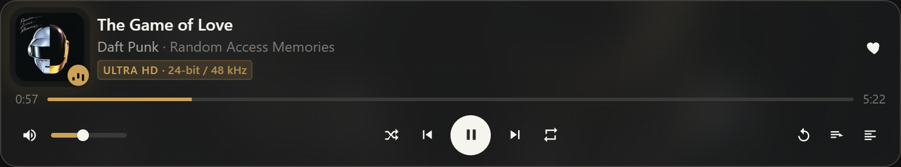
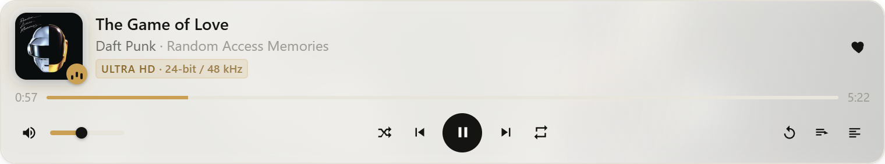
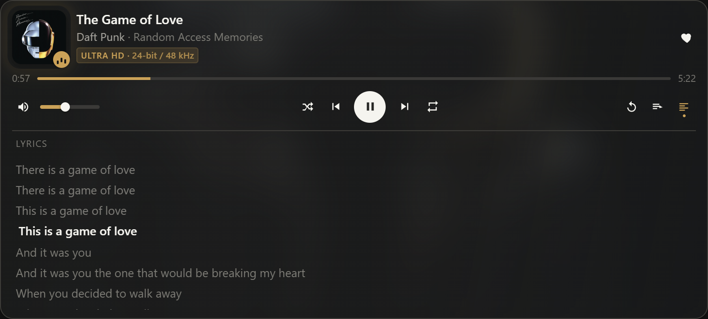
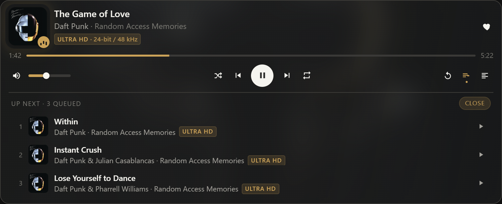

# Amazon Music MCP

Amazon Music has no public playback API, so this doesn't use one. It drives the web player
instead: a real Microsoft Edge window, parked off-screen, that Claude clicks through the
same way you would.

Ask Claude to play something and it plays, with a card in the conversation for the
transport controls, the queue and the lyrics.

> Not affiliated with Amazon. It automates the web player in your own browser profile,
> signed in as you. The server never handles your password: `login` puts the Edge window on
> screen and you sign in yourself, CAPTCHA and 2FA included.

## The player widget

Every screenshot here is the real card showing a real track. `scripts/shots.mjs` renders it
from whatever the player is actually doing.



The colour comes from the album cover, pulled out of the artwork in the browser page. The
image behind it is Amazon's artist backdrop, not the cover art blown up.

Light theme re-derives that colour rather than reusing it, because a tint that reads well on
a dark card can be invisible on a pale one. Anything you have to read is walked away from
the background until it clears 4.5:1.



The badge carries the numbers Amazon reports behind it, so "24-bit / 48 kHz" is what is
coming out of the browser right now, not what the track could manage on better hardware.

Lyrics follow the song, and stop following the moment you scroll them yourself:



Up next reads Amazon's own play queue. Click a row to jump to it.



While a call is still running the card shows this rather than the song before it:


## How it works

Edge rather than a bundled Chromium, because Amazon Music streams under Widevine and a
stock Playwright browser can't decrypt it. The window is real and rendering. It just sits at
-32000,-32000 with its taskbar button stripped off by a bit of Win32 through PowerShell.
Minimizing it would be easier, but the site stops painting its shadow DOM the moment
`document.visibilityState` goes hidden, and a player that has stopped painting can't be
clicked.

It runs in a private profile at `%USERPROFILE%\.amazon-music-mcp\profile` with extensions
and sync off. Your everyday Edge is untouched, and you sign in once.

There are two tabs, each in its own off-screen window. The player tab owns playback and
never navigates while something is playing; the browse tab takes `search`, `my_playlists`
and `open_url` so a page load can't cut the music off. Any third tab gets closed on the next
attach.

Nothing ever starts on its own. Edge launches silent and stays silent until a play tool is
called.

Edge is spawned detached and attached over CDP, so quitting Claude Desktop doesn't stop the
music. It can also start at Windows sign-in, silently, so the player is warm before you open
anything.

The runtime lives in `%USERPROFILE%\.amazon-music-mcp` rather than `%LOCALAPPDATA%` for a
specific reason: Claude Desktop ships as an MSIX package, and anything its child processes
write under AppData gets redirected into the package's own LocalCache, where the login-time
launcher can't find it.

### Speed

A "play X" request takes 1.9 to 2.5 seconds end to end, most of which is Amazon searching
and buffering. Asking for something already playing answers in about 50 ms. Widget state
polls cost 8 to 17 ms, because everything expensive is warmed in the background and served
from cache: the artist backdrop, the lyrics, the quality numbers and the Autoplay setting
all arrive a beat after the card first paints rather than holding it up.

### Stopping at the end of one song

Amazon's Autoplay setting only stops the queue being *extended*. Ask for a single track with
it off and Amazon still queues "similar" songs, so playback rolls straight on into music you
never asked for.

The fix runs inside the page. The progress slider only reports whole seconds, so the exact
end has to be interpolated from the moment it last stepped, and a CDP round trip per poll
leaves a second of the next track audible before anything can react. Doing it in the page
means pausing 0.35 s early instead, which leaves the song you asked for loaded rather than
the one after it. Albums, playlists and stations are collections and keep playing.

## Requirements

Windows, since the off-screen window and taskbar handling are Win32. Node 20 or newer, at
`%ProgramFiles%\nodejs`, which is where the build scripts look. Microsoft Edge. An Amazon
Music account you can sign in to, Unlimited if you want the HD and Ultra HD badges to mean
anything. Claude Desktop with MCP Apps support for the widget, though the tools work
without it.

## Install

The extension route is the one that gives the connector a real icon:

```powershell
powershell -NoProfile -ExecutionPolicy Bypass -File scripts\setup.ps1
powershell -NoProfile -ExecutionPolicy Bypass -File scripts\pack-extension.ps1
```

That writes `%USERPROFILE%\.amazon-music-mcp\amazon-music.mcpb`. Double-click it, or drag it
onto Claude Desktop → Settings → Extensions. (Or download the `.mcpb` from the
[latest release](https://github.com/ShadowsDistant/Amazon-Music-MCP/releases/latest) and
skip the build.)

Claude Desktop draws a letter avatar for anything listed in `claude_desktop_config.json` and
ignores the icons a server advertises over MCP. Installed extensions carry their own
`icon.png`, which is why Filesystem and pdf-viewer have artwork and a config-file server
never will.

If you had it installed the other way, drop the old entry so it isn't listed twice:

```bash
node "$HOME/.amazon-music-mcp/build/scripts/install.mjs" --remove
```

### Or by config file, without the icon

```powershell
powershell -NoProfile -ExecutionPolicy Bypass -File scripts\setup.ps1 -Install -Autostart
```

`setup.ps1` copies the sources to `%USERPROFILE%\.amazon-music-mcp\build` and runs npm, tsc
and the widget bundler there, so nothing heavy lands in OneDrive.

`-Install` merges this into `%APPDATA%\Claude\claude_desktop_config.json`, after writing a
timestamped backup:

```json
"amazon-music": {
  "command": "C:\\Program Files\\nodejs\\node.exe",
  "args": ["C:\\Users\\<you>\\.amazon-music-mcp\\build\\dist\\index.js"],
  "env": {
    "AMZ_EDGE_EXE": "C:\\Program Files (x86)\\Microsoft\\Edge\\Application\\msedge.exe",
    "AMZ_PROFILE_DIR": "C:\\Users\\<you>\\.amazon-music-mcp\\profile",
    "AMZ_LOG_FILE": "C:\\Users\\<you>\\.amazon-music-mcp\\logs\\server.log"
  }
}
```

`-Autostart` drops a shortcut in your Startup folder that runs a hidden launcher
(`launch-edge.vbs` → `launch-edge.ps1`), starting the same off-screen Edge the server would
and removing its taskbar button. Undo it with
`node "%USERPROFILE%\.amazon-music-mcp\build\scripts\autostart.mjs" --remove`.

Either way, fully quit and relaunch Claude Desktop afterwards.

### Signing in

Ask Claude to run `login`. An Edge window appears on the Amazon sign-in page; sign in there,
then ask for `hide_window`. The session lives in the private profile, so that's a one-time
step.

## Tools

| Tool | Purpose |
|---|---|
| `status` | Browser running? Signed in? Page visibility, playback state. Never launches Edge. |
| `login` / `hide_window` / `quit_browser` | Show the window for sign-in, tuck it away, or close Edge. |
| `player` ⧉ | Show the interactive player widget. |
| `now_playing` ⧉ | Title, artist, album, artwork, artist backdrop, tags, state, position/duration, shuffle/repeat/like, current lyric line. |
| `lyrics` | Full lyrics as lines plus the index of the line being sung. |
| `audio_quality` | Real playback numbers: bit depth and sample rate for the track, the device and the output. |
| `set_autoplay {enabled?}` | Read or change Amazon's Autoplay setting. Omit `enabled` to just read it. |
| `play` ⧉, `pause`, `play_pause`, `next` ⧉, `previous` ⧉ | Transport. |
| `set_volume {level}` | 0-100. |
| `shuffle {mode?}` / `repeat {mode}` | on/off; off / all (the playlist, album or queue) / one (the current song). Both return the full now-playing state. |
| `search {query, type?, limit?}` | Ranked, typed results with hrefs and tags. Browse tab, so playback continues. |
| `play_by_query {query, type?}` ⧉ | Parse the request, search, play the best match. Returns the runners-up too. |
| `play_href {href}` ⧉ | Play a specific result, queue row or playlist by href. |
| `queue_add {query?\|href?, position?}` | "Play next" or "Add to queue" without interrupting anything. |
| `open_url {url}` | Navigate to any music.amazon.com page. |
| `my_playlists` / `play_playlist {name?\|href?}` ⧉ | Library playlists. |
| `like` / `unlike` / `add_to_playlist {playlist}` | Act on the current track. |
| `queue` | Upcoming tracks. |
| `debug_snapshot {selector?}` | Accessibility snapshot, for repairing selectors. |

⧉ renders the player widget. The widget calls the same tools back through the host;
`ui_state` is a widget-only helper hidden from the model.

Requests are parsed before they are searched, so "get lucky by daft punk", "the album
Discovery" and "some lofi playlist" all land on the right kind of result.

## Environment variables

| Variable | Default |
|---|---|
| `AMZ_EDGE_EXE` | first existing of the `Program Files (x86)` / `Program Files` Edge paths |
| `AMZ_PROFILE_DIR` | `%USERPROFILE%\.amazon-music-mcp\profile` |
| `AMZ_CDP_PORT` | `9333` |
| `AMZ_LOG_FILE` | unset (stderr only) |

## Testing without Claude Desktop

```powershell
& "C:\Program Files\nodejs\node.exe" "$HOME\.amazon-music-mcp\build\scripts\smoke.mjs" --play
```

Spawns the server over stdio exactly as Claude Desktop does, lists the tools and runs
`status`, `search` and `debug_snapshot`. With `--play`, and if you're signed in, it also
runs `play_by_query` → `now_playing` → `pause`. Add `--quit` to close Edge at the end.

Any tool, directly (from a bash-style shell, so the JSON survives quoting):

```bash
node "$HOME/.amazon-music-mcp/build/scripts/call.mjs" play_by_query '{"query":"get lucky","type":"song"}' now_playing
```

`node scripts/serve-ui.mjs` serves the widget at `http://localhost:8765` with no MCP host
behind it. `?demo` fills it with a sample track, `?demo&lyrics` and `?demo&queue` open the
panels, `?skeleton` shows the loading state, and `?accent=r,g,b` checks the contrast
correction against an awkward cover. `?demo&poll` re-renders the same state on the poll
interval, the way a host drives it: anything that rebuilds or re-animates there is a
flicker, so watch it with a MutationObserver rather than by eye.

Every tool logs its duration to stderr. `play_by_query` breaks that down by phase, and the
`waitForTrack` and `single-track` lines say what the player actually did. When playback
misbehaves, read those before anything else.

## Limitations

Search rows carry only `explicit`. Amazon's search payload has no quality badges at all;
the Ultra HD, HD and Atmos chips exist on the player bar, in the queue and on detail pages,
which is where those tags come from.

The connector icon needs the extension install. The server does advertise icons over MCP
(`serverInfo.icons`, check with `scripts/check-icons.mjs`), but Claude Desktop ignores them
for config-file servers.

Lyrics and the artist backdrop only exist in the full Now Playing View, which has to be shut
for anything row-based to work, since it covers the navbar and the player bar. The server
opens it once per track in the background, takes both, caches them and closes it again. The
synced highlight is only live while that view is open, which the `lyrics` tool arranges;
otherwise the lines come back with `activeIndex: -1`.

## Troubleshooting

**Tools time out or come back empty.** Run `status`. `visibility` has to be `visible`. If
it's `hidden`, because the window got minimized or the screen locked, call `hide_window`,
which re-normalizes it off-screen.

**`not_logged_in`.** Run `login`, sign in, then `hide_window`.

**A selector stopped matching**, because Amazon changed the page. Call `debug_snapshot`,
optionally with a CSS selector, and fix `src/selectors.ts`. Every site-specific string in
the project is in that one file.

**No sound.** Check the Edge window isn't muted (`login` shows it) and that Widevine loaded,
under `edge://components`.

**"Could not connect to host" in the widget.** That Claude Desktop build doesn't support MCP
Apps. The plain tool results still work.

**Edge reappeared in the taskbar.** Call `hide_window`, which re-applies
`scripts/taskbar.ps1`, or run that script yourself with `-ProfileDir`.

**More than two tabs.** The server trims to the player tab plus one browse tab on every
attach; `quit_browser` followed by any play tool gives a clean restart.

**Logs.** `%USERPROFILE%\.amazon-music-mcp\logs\server.log`, and Claude Desktop's own
`%APPDATA%\Claude\logs\mcp-server-amazon-music.log`. The server never writes to stdout.

**Removing it.** `node "%USERPROFILE%\.amazon-music-mcp\build\scripts\install.mjs" --remove`,
and the same for `autostart.mjs`.

## Layout

```
src/index.ts        server bootstrap (stdio), icon + instructions
src/tools.ts        tool schemas + registration, widget resource, error wrapping
src/browser.ts      spawn/attach Edge over CDP, show/hide window, login detection
src/config.ts       paths + the shared Edge command line
src/selectors.ts    every site-specific selector
src/tags.ts         explicit / Ultra HD / HD / Atmos tag parsing
src/accent.ts       album-cover colour extraction (runs in the page, cached per artwork)
src/quality.ts      the real bit-depth / sample-rate numbers behind the HD badge
src/singleTrack.ts  the in-page end-of-song stop for single-track requests
src/player.ts       now_playing, transport, volume, shuffle/repeat, like, queue
src/search.ts       query parsing + ranking, search, play_by_query / play_href, queue_add
src/library.ts      playlists, add_to_playlist
ui/player.html+ts   the MCP App widget (bundled by scripts/build-ui.mjs)
assets/icon.*       server icon (make-icon.ps1 renders the PNG)
scripts/setup.ps1   build into %USERPROFILE%\.amazon-music-mcp (outside OneDrive)
scripts/install.mjs merge/remove the Claude Desktop config entry
scripts/autostart.mjs  create/remove the Startup-folder shortcut + hidden launcher
scripts/taskbar.ps1 hide/restore the Edge window's taskbar button (Win32 via PowerShell)
scripts/shots.mjs   render the README screenshots from the live player state
scripts/smoke.mjs, call.mjs, serve-ui.mjs   test utilities
```

## Development

`setup.ps1` is the build. It syncs `src`, `ui`, `scripts` and `assets` into
`%USERPROFILE%\.amazon-music-mcp\build`, installs dependencies there, runs `tsc` and bundles
the widget into one self-contained `dist/ui/player.html`. Nothing is written back into the
source tree, so it's safe under OneDrive.

Two things about the site are worth knowing before you change anything. Amazon Music is
built from Stencil web components with *open* shadow roots, so ordinary CSS selectors pierce
them in Playwright and there's no need for anything clever. And result rows exist as empty
skeletons before they hydrate, which is why `itemReady` insists on `[primary-text]`; match
the bare tag and you'll parse a page of blanks.

The screenshots come from `node scripts/shots.mjs [outDir]`, which reads the live player
state over stdio, waits for the backdrop and quality numbers to warm up, and renders the
widget in a throwaway headless Edge. Play something first.

## Licence

None chosen yet, so default copyright applies: readable here, not licensed for reuse. Add a
`LICENSE` file to change that.
